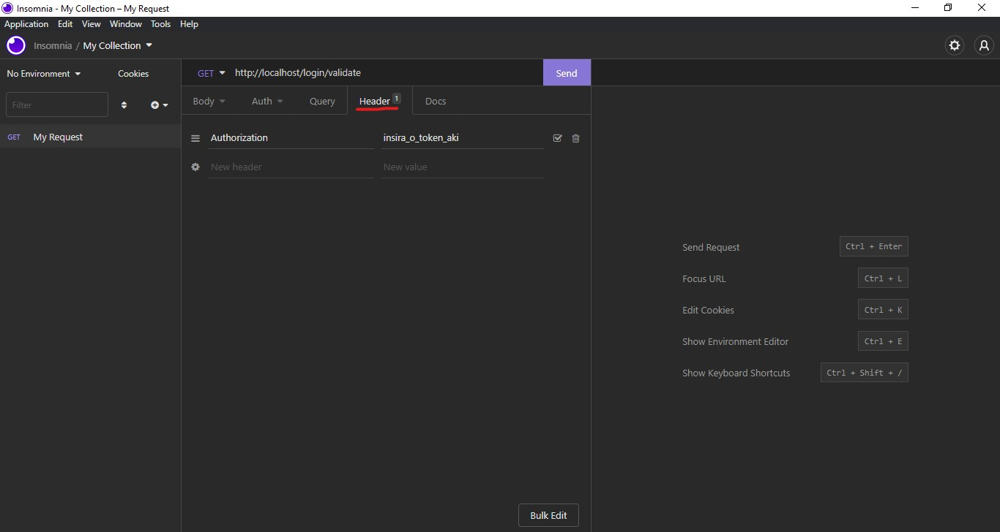

# Boas vindas ao repositório do TFC - Trybe Futebol Clube! ⚽️

[Agora a aplicação está online :D](https://trybe-futebol-club-dihsantanna.herokuapp.com/)


O `TFC` é um site informativo sobre partidas e classificações de futebol! ⚽️

Fui responsável pelo desenvolvimento de uma API (utilizando o método `TDD`) e também integrar *- através do docker-compose -* as aplicações para que funcionem consumindo um banco de dados.

Nesse projeto, foi construido **um back-end dockerizado utilizando modelagem de dados através do Sequelize**. O desenvolvimento **respeitou as regras de negócio** providas no projeto e **a API é capaz de ser consumida por um front-end já provido nesse projeto**.

Foi exercitado nesse projeto:

 - Realizar a dockerização dos apps, network, volume e compose;
 - Modelar dados com **MySQL** através do **Sequelize**;
 - Criar e associar tabelas usando `models` do `sequelize`;
 - Construir uma **API REST** com endpoints para consumir os models criados;
 - Fazer um `CRUD` utilizando `ORM`;

---

## O que foi desenvolvido

Uma aplicação responsável pela serie A do campeonato __TFC - Trybe Futebol Clube__. Começando pela API, foi desenvolvido alguns endpoints (seguindo os princípios **REST**) que estão conectados ao banco de dados!

O back-end implementa regras de negócio para popular adequadamente a tabela disponível no front-end que é exibida para a pessoa usuária do sistema.

---

## Desenvolvimento

Foi desenvolvida uma aplicação dockerizada em `Node.js + Typescript` usando o pacote `sequelize`.

Para adicionar uma partida é necessário usuário e senha, portanto a pessoa deverá estar logada para fazer as alterações. Temos um relacionamento entre as tabelas `clubs` e `matchs` para fazermos as atualizações das partidas.

---

# Instalação do projeto

## Executado com Docker:

1. Clone o repositório
  * `git clone git@github.com:dihsantanna/trybe-futebol-clube.git`.
  * Entre na pasta do repositório que você acabou de clonar:
    * `cd trybe-futebol-clube`

2. Instale as dependências
  * `npm install`

3. Execute a aplicação utilizando o *docker compose*
  * execute o comando `npm run compose:up`

4. Para parar a execução:
  * execute o comando `npm run compose:down` 

---

## Executando com sem o docker

`IMPORTANTE`: Caso queira executar tudo sem utilizar o docker será necessário configurar as variáveis de ambiente dentro de `app/backend`. 
* renomeie o arquivo `.env.example` para `.env`;
* adicione as chaves `DB_HOST`, `DB_USER` e `DB_PASS` com as informações do seu banco de dados `mysql` local.

1. Execute os passos 1 e 2 do executando com Docker;
2. Na raiz do projeto execute:
* `npm run backend`
3. Abra outro terminal e na raiz do projeto execute:
* `npm run frontend`
4. Para parar as execuções pressione `ctrl+c` nos terminais onde o backend e o frontend estão sendo executados.
---

# Utilizando a aplicação

## Frontend

* primeiro em seu navegador acesse [http://localhost:3000/](http://localhost:3000/) pra acessar o as funcionalidades da aplicação;

### Login

- Para logar basta inserir:
  ```json
  email: "admin@admin.com",
  password: "secret_admin"
  ```

** relembrando: a parte de frontend não foi produzida por mim e sim pela equipe de instrução da Trybe.

## Backend

Aqui você deverá utilizar um cliente de API REST, eu recomendo o [Insomnia](https://github.com/Kong/insomnia) ;

### Login

1. Para logar basta acessar o endpoint do tipo **POST** `http://localhost:3001/login` e inserir no body:
  
    ```json
    {
      "email": "admin@admin.com", // string
      "password": "secret_admin" // string
    }
    ```

   * você deverá receber um status `200`  com o resultado parecido com este:

    ```json
    {
      "user": {
        "id": 1,
        "username": "Admin",
        "role": "admin",
        "email": "admin@admin.com"
      },
      "token": "123.456.789" // Aqui deve ser o token gerado pelo backend, guarde ele.
    }
    ```

2. Pode-se verificar qual o tipo de regra de autorização o usuário possui através do endpoint do tipo **GET** `http://localhost:3001/login/validate`
   * adicione o token gerado ao logar, no header da requisição como valor da chave `Authorization`, caso esteja utilizando o insomnia faça como na imagem abaixo:
    

A resposta deve ser de status `200` com uma `string` contendo a `role` do usuário que pode ser `"admin"` ou `"user"` 

### Clubs

1. Requisições do tipo **GET**.
    * Acesse o endpoint `http://localhost:3001/clubs` para obter o resultado com todos os clubs, semelhante a este:
    ```json
    [
      {
        "id": 1,
        "clubName": "Avaí/Kindermann"
      },
      {
        "id": 2,
        "clubName": "Bahia"
      },
      {
        "id": 3,
        "clubName": "Botafogo"
      },
      ...
    ]
    ```

    * Acesse o endpoint `http://localhost:3001/clubs/:id` , onde o `:id` é o numero de *id* do time que que queira retornar. Trocando o `:id` por `7` obtemos um resultado semelhante a este:
    ```json
      {
        "id": 7,
        "clubName": "Flamengo"
      }
    ```

### Matchs

1. Requisições do tipo **GET**.
    * Acesse o endpoint `http://localhost:3001/matchs` para obter o resultado com todas as partidas, semelhante a este:
    ```json
    [
      {
        "id": 1,
        "homeTeam": 16,
        "homeTeamGoals": 1,
        "awayTeam": 8,
        "awayTeamGoals": 1,
        "inProgress": false,
        "homeClub": {
          "clubName": "São Paulo"
        },
        "awayClub": {
          "clubName": "Grêmio"
        }
      },
      ...
      {
        "id": 41,
        "homeTeam": 16,
        "homeTeamGoals": 2,
        "awayTeam": 9,
        "awayTeamGoals": 0,
        "inProgress": true,
        "homeClub": {
          "clubName": "São Paulo"
        },
        "awayClub": {
          "clubName": "Internacional"
        }
      }
    ]
    ```

    * Acesse o endpoint `http://localhost:3001/matchs?inProgress=true` para obter o resultado com todas as partidas em andamento, semelhante a este:
    ```json
    [
      {
        "id": 41,
        "homeTeam": 16,
        "homeTeamGoals": 2,
        "awayTeam": 9,
        "awayTeamGoals": 0,
        "inProgress": true,
        "homeClub": {
          "clubName": "São Paulo"
        },
        "awayClub": {
          "clubName": "Internacional"
        }
      },
      {
        "id": 42,
        "homeTeam": 6,
        "homeTeamGoals": 1,
        "awayTeam": 1,
        "awayTeamGoals": 0,
        "inProgress": true,
        "homeClub": {
          "clubName": "Ferroviária"
        },
        "awayClub": {
          "clubName": "Avaí/Kindermann"
        }
      }
    ]
    ```

   * Acesse o endpoint `http://localhost:3001/matchs?inProgress=false` para obter o resultado com todas as partidas encerradas, semelhante a este:
    ```json
    [
      {
        "id": 1,
        "homeTeam": 16,
        "homeTeamGoals": 1,
        "awayTeam": 8,
        "awayTeamGoals": 1,
        "inProgress": false,
        "homeClub": {
          "clubName": "São Paulo"
        },
        "awayClub": {
          "clubName": "Grêmio"
        }
      },
      {
        "id": 2,
        "homeTeam": 9,
        "homeTeamGoals": 1,
        "awayTeam": 14,
        "awayTeamGoals": 1,
        "inProgress": false,
        "homeClub": {
          "clubName": "Internacional"
        },
        "awayClub": {
          "clubName": "Santos"
        }
      }
    ]
    ```

2. Requisições do tipo **POST**.
    * Acesse o endpoint `http://localhost:3001/matchs` e adicione o token gerado ao logar, no header da requisição como valor da chave `Authorization` para adicionar uma nova partida.
      - o **body** dessa requisição deve ser semelhante a este:
      ```json
      {
        "homeTeam": 16, // O valor deve ser o id do time
        "awayTeam": 8, // O valor deve ser o id do time
        "homeTeamGoals": 2, // total de gols do homeTeam
        "awayTeamGoals": 2, // total de gols do awayTeam
        "inProgress": true // a partida deve ser criada como em progresso
      }
      ``` 

      - caso a partida seja inserida com sucesso retorna-se os dados da partida:
      ```json
      {
        "id": 1,
        "homeTeam": 16,
        "homeTeamGoals": 2,
        "awayTeam": 8,
        "awayTeamGoals": 2,
        "inProgress": true,
      }
      ```

3. Requisições do tipo **PATCH**.
    * Acesse o endpoint `http://localhost:3001/matchs/:id/finish` e adicione o token gerado ao logar, no header da requisição como valor da chave `Authorization` para finalizar uma partida. Onde o `:id` é o *id* da partida a ser finalizada. 
   
    * Acesse o endpoint `http://localhost:3001/matchs/:id` e adicione o token gerado ao logar, no header da requisição como valor da chave `Authorization` para editar uma partida em progresso. Onde o `:id` é o *id* da partida a ser editada.

      - o **body** dessa requisição deve ser semelhante a este:
      ```json
      {
        "homeTeamGoals": 3, // total de gols do homeTeam
        "awayTeamGoals": 1 // total de gols do awayTeam
      }
      ``` 

      **Atenção:** O mesmo endpoint pode ser usado para finalizar uma partida em andamento, basta não passar um body na requisição.
    
### Leaderboard

1. Requisições do tipo **GET**.
    * Acesse o endpoint `http://localhost:3001/leaderboard` para retornar a ordenação de classificação dos times segundo as partidas já encerradas.
      - A ordenação da tabela é feita seguindo as seguintes regras :
      `1° Total de pontos, 2º Total de Vitórias, 3º Saldo de gols, 4º Gols a favor, 5º Gols contra.` 
      - retorno esperado de ser semelhante a este:
      ```json
      [
        {
          "name": "Palmeiras",
          "totalPoints": 13,
          "totalGames": 5,
          "totalVictories": 4,
          "totalDraws": 1,
          "totalLosses": 0,
          "goalsFavor": 17,
          "goalsOwn": 5,
          "goalsBalance": 12,
          "efficiency": 86.67
        },
        {
          "name": "Corinthians",
          "totalPoints": 12,
          "totalGames": 5,
          "totalVictories": 4,
          "totalDraws": 0,
          "totalLosses": 1,
          "goalsFavor": 12,
          "goalsOwn": 3,
          "goalsBalance": 9,
          "efficiency": 80
        },
        {
          "name": "Santos",
          "totalPoints": 11,
          "totalGames": 5,
          "totalVictories": 3,
          "totalDraws": 2,
          "totalLosses": 0,
          "goalsFavor": 12,
          "goalsOwn": 6,
          "goalsBalance": 6,
          "efficiency": 73.33
        },
        ...
      ]
      ```

      - também é possível filtrar pelos `jogos em casa` e `fora de casa` , basta usar os endpoints:
        - `http://localhost:3001/leaderboard/home` para jogos em casa;
        - `http://localhost:3001/leaderboard/away` para jogos fora de casa;
***
